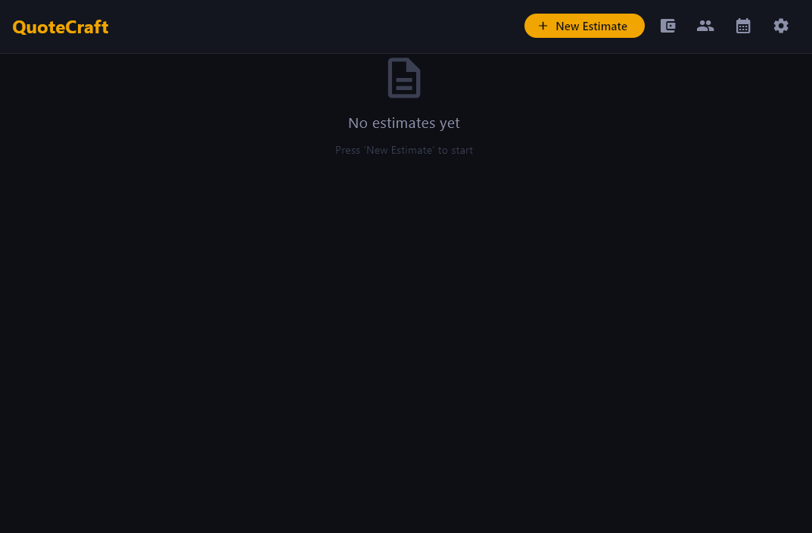
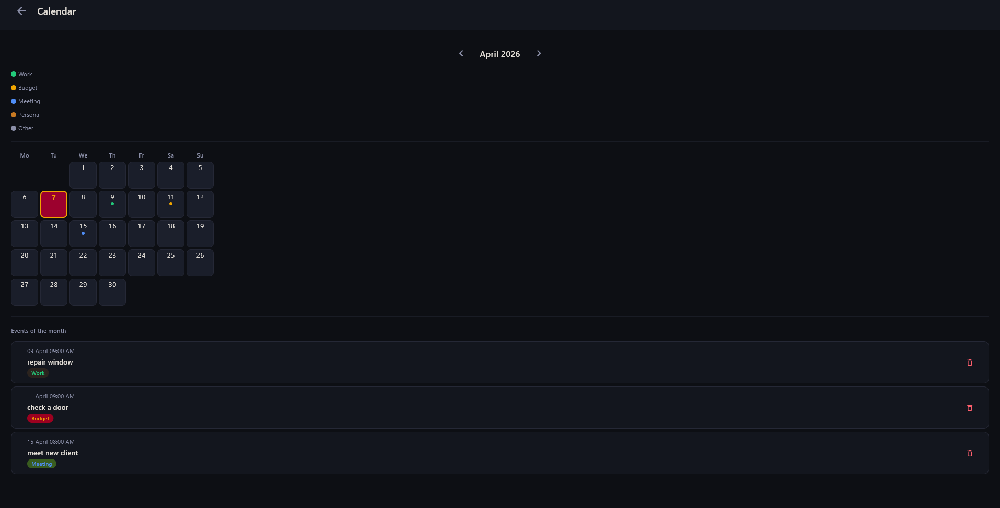

# QuoteCraft

**QuoteCraft** is a desktop application to manage business estimates and personal finances. It is built with **Python** and **Flet**, featuring a clean design.

  
  
  

---

## Main Features

* **Estimate Management:** Create and edit professional estimates for clients.
* **PDF Export:** Generate clean PDF documents ready to send.
* **Multi-language Support:** Works in **English** and **Spanish** (with support for accents and special characters).
* **Finance Control:** Track income, expenses, and taxes. Export annual financial reports.
* **Modern UI:** Simple and intuitive interface with rounded corners and smooth navigation.

---

## Screenshots

  <h3>1. Main Menu</h3>
  

  <h3>2. Create Estimate</h3>
  

  <h3>3. Manage Finances</h3>
  

  <h3>4. Manage Clients</h3>
  

  <h3>5. Calendar View</h3>
  

---
## Tech Stack

* **Python**: The core programming language.
* **Flet**: Framework for the user interface (based on Flutter).
* **FPDF**: Library to create PDF reports.
* **SQLite**: Database to store all your information locally.

## Project Structure

* **`views/`**: UI screens and Flet components.
* **`services/`**: Business logic, PDF generation, and calculations.
* **`utils/`**: Helper functions and common tools for the app.
* **`database/`**: Database connection and SQL query management.
* **`locales/`**: JSON translation files for the interface and PDFs.
* **`assets/`**: Images, logos, and branding resources.
* **`screenshots/`**: App images for the README and documentation.
* **`data/`**: Storage for specific application data or local files.
**`backups/`**: Local security copies and source code snapshots.
* **`pdfs/`**: Default output folder for generated documents.

## Main Files

* `main.py`: The main entry point to launch QuoteCraft.
* `requirements.txt`: List of necessary libraries (Flet, FPDF, etc.).
* `flet.yaml`: Configuration file for the Flet application.
* `LICENSE`: Legal terms for the use of this software.
* `CHANGELOG.md`: History of updates and new features added.
* `build_app.bat`: Script to automate the building process.
* `.gitignore`: Tells Git which files to ignore (like venv or local backups).

## Why QuoteCraft?

I built this tool to bridge the gap between complex accounting software and simple spreadsheets. The goal was to create a lightweight, cross-platform solution with a premium UI that small business owners actually enjoy using.

## Connect with me

* **LinkedIn:** [Insert your link here]

## Author

* **Darley Omar Silot Arcaya** - *Computer Science*

> [!NOTE]
> **QuoteCraft** is currently in active development. While the source code is available for review and educational purposes, we are exploring commercial features and official releases soon. Stay tuned for updates!